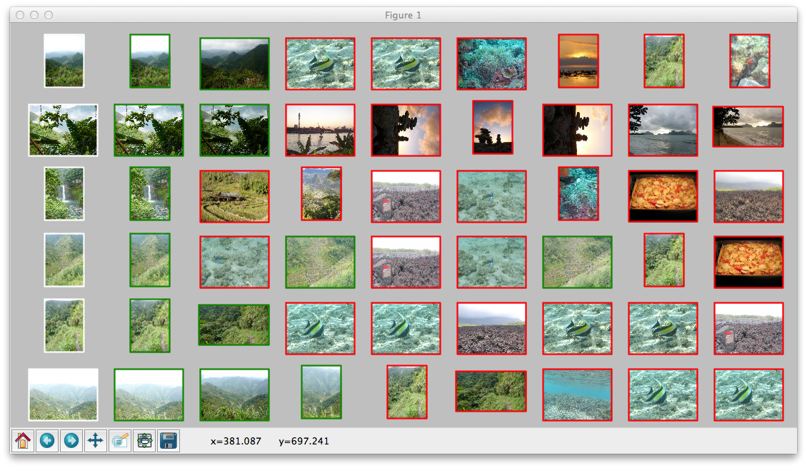

Image indexing example
----------------------

Here we work out an image indexing engine and apply it to a tiny image
dataset.

We are going to work on the 100 first query images of the
`Holidays <http://lear.inrialpes.fr/~jegou/data.php#holidays>`_ dataset,
and their associated database examples. Download
the images and the SIFT descriptors from here:

http://pascal.inrialpes.fr/data2/douze/holidays_subset/images.tgz
http://pascal.inrialpes.fr/data2/douze/holidays_subset/sifts.tgz

Unzip them to a ``holidays_100`` subdirectory.

Image indexing in Python with Fisher vectors
++++++++++++++++++++++++++++++++++++++++++++

Image indexing based on Fisher vectors consists in computing a global
Fisher vector (FV) for each image, using the local SIFTs from these
images. The L2 distance between FVs is a good approximation of
the similarity of the contents of the images. See
`Aggregating local image descriptors into compact codes <https://hal.inria.fr/inria-00633013>`_
for more details.

The FV computation relies on a training where a Gaussian Mixture Model
(GMM) is fitted to a set of representative local descriptors. For
simplicity, we are going to use the descriptors of the database we
index.

In the following, you can just copy/paste the code to the Python
interpreter (or put it in a script). You can inspect the variables,
which are plain numpy arrays.

We first load all the descriptors

.. code-block:: python

   import os
   import numpy as np
   from yael import ynumpy

   # list of available images
   image_names = [filename.split('.')[0]
                  for filename in os.listdir('holidays_100')
                  if filename.endswith('.jpg')]

   # load the SIFTs for these images
   image_descs = []
   for imname in image_names:
       desc, meta = ynumpy.siftgeo_read("holidays_100/%s.siftgeo" % imname)
       if desc.size == 0: desc = np.zeros((0, 128), dtype = 'uint8')
       # we drop the meta-information (point coordinates, orientation, etc.)
       image_descs.append(desc)

Now we can sample the descriptors to reduce their dimensionality by
PCA and computing a GMM. For a GMM of size k (let's set it to 64), we
need about 1000*k training descriptors

.. code-block:: python

   # make a big matrix with all image descriptors
   all_desc = np.vstack(image_descs)

   k = 64
   n_sample = k * 1000

   # choose n_sample descriptors at random
   sample_indices = np.random.choice(all_desc.shape[0], n_sample)
   sample = all_desc[sample_indices]

   # until now sample was in uint8. Convert to float32
   sample = sample.astype('float32')

   # compute mean and covariance matrix for the PCA
   mean = sample.mean(axis = 0)
   sample = sample - mean
   cov = np.dot(sample.T, sample)

   # compute PCA matrix and keep only 64 dimensions
   eigvals, eigvecs = np.linalg.eig(cov)
   perm = eigvals.argsort()                   # sort by increasing eigenvalue
   pca_transform = eigvecs[:, perm[64:128]]   # eigenvectors for the 64 last eigenvalues

   # transform sample with PCA (note that numpy imposes line-vectors, 
   # so we right-multiply the vectors)
   sample = np.dot(sample, pca_transform)

   # train GMM
   gmm = ynumpy.gmm_learn(sample, k)

The gmm is a tuple containing the a-priori weights per mixture
component, the mixture centres and the diagonal of the component
covariance matrices (the model assumes a diagonal matrix, otherwise
the descriptor would be way too long).

The training is finished. The next stage is to encode the SIFTs into
one vector per image. We choose to include only the derivatives w.r.t.
mu in the FV, which results in a FV of size k * 64.

.. code-block:: python

   image_fvs = []
   for image_desc in image_descs:
      # apply the PCA to the image descriptor
      image_desc = np.dot(image_desc - mean, pca_transform)
      # compute the Fisher vector, using only the derivative w.r.t mu
      fv = ynumpy.fisher(gmm, image_desc, include = 'mu')
      image_fvs.append(fv)

   # make one matrix with all FVs
   image_fvs = np.vstack(image_fvs)

   # normalizations are done on all descriptors at once
   
   # power-normalization
   image_fvs = np.sign(image_fvs) * np.abs(image_fvs) ** 0.5

   # L2 normalize
   norms = np.sqrt(np.sum(image_fvs ** 2, 1))
   image_fvs /= norms.reshape(-1, 1)

   # handle images with 0 local descriptor (100 = far away from "normal" images)
   image_fvs[np.isnan(image_fvs)] = 100

Now the FV can be used to compare images, so we compute for each Holidays
query image the nearest images in the ``image_fvs`` matrix.

.. code-block:: python

   # get the indices of the query images (the subset of images that end in "00")
   query_imnos = [i for i, name in enumerate(image_names) if name[-2:] == "00"]

   # corresponding descriptors
   query_fvs = image_fvs[query_imnos]

   # get the 8 NNs for all query images in the image_fvs array
   results, distances = ynumpy.knn(query_fvs, image_fvs, nnn = 8)

The mAP performance for this search can be computed as: 
    
.. code-block:: python

   aps = []
   for qimno, qres in zip(query_imnos, results):
       qname = image_names[qimno]
       # collect the positive results in the dataset
       # the positives have the same prefix as the query image
       positive_results = set([i for i, name in enumerate(image_names)
                               if name != qname and name[:4] == qname[:4]])
       #
       # ranks of positives. We skip the result #0, which is the query image
       ranks = [i for i, res in enumerate(qres[1:]) if res in positive_results]
       #
       # accumulate trapezoids with this basis
       recall_step = 1.0 / len(positive_results)
       ap = 0
       for ntp,rank in enumerate(ranks):
          # ntp = nb of true positives so far
          # rank = nb of retrieved items so far
          # y-size on left side of trapezoid:
	  precision_0 = ntp/float(rank) if rank > 0 else 1.0
          # y-size on right side of trapezoid:
          precision_1 = (ntp + 1) / float(rank + 1)
          ap += (precision_1 + precision_0) * recall_step / 2.0
       print "query %s, AP = %.3f" % (qname, ap)
       aps.append(ap)

    print "mean AP = %.3f" % np.mean(aps)

Now we display the search results for a few query images. There is one
line per query image, which shows the image, and a row of retrieval
results. The correct results have a green rectangle around them,
negative ones a red rectangle. Most code is just matplotlib commands
to adjust the image layout.

.. code-block:: python
   
   from matplotlib import pyplot
   from matplotlib.image import imread
   
   nrow = 6   # number of query images to show
   nres = 8   # number of results per query

   def show_image(imno, frame_color): 
       im = imread("holidays_100/%s.jpg" % image_names[imno])
       pyplot.imshow(im)
       h, w = im.shape[:2]
       pyplot.plot([0, 0, w, w, 0], [0, h, h, 0, 0], frame_color, linewidth = 2)
       pyplot.axis('off')

   # reduce the margins
   pyplot.subplots_adjust(wspace = 0, hspace = 0, 
                          top = 0.99, bottom = 0.01, left = 0.01, right = 0.99)

   no = 1  # index current of subfigure
   for qno in range(nrow):        
       pyplot.subplot(nrow, nres + 1, no); no += 1
       # show query image with white outline
       qimno = query_imnos[qno]
       show_image(qimno, 'w')
       for qres in results[qno, :nres]: 
           pyplot.subplot(nrow, nres + 1, no); no += 1
           # use image name to determine if it is a TP or FP result
	   is_ok = image_names[qres][:4] == image_names[qimno][:4]
    	   show_image(qres, 'g' if is_ok else 'r')   	  

   pyplot.show()    

This part requires matplotlib to be installed, which can be done via
macports on the Mac and your usual package installation tool on
Linux. The output looks like:

Note that the query image always appears as the first retrieval
result, because it is included in the dataset. 

Image indexing in Matlab with inverted files
++++++++++++++++++++++++++++++++++++++++++++
